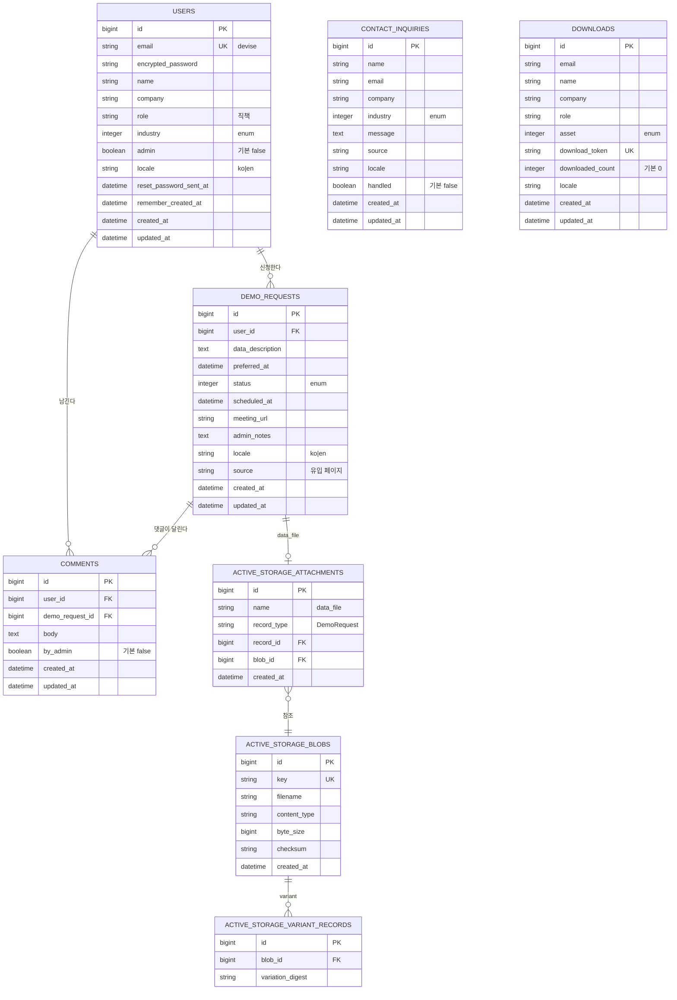

# XAISimTier 사이트 아키텍처 (v1.0)

- **버전:** v1.0 (2026-05-14)
- **근거:** [`prd.md`](../../prd.md) §7 Data Model · [Pitch Deck v2](../../XAISimTier_PitchDeck_v2.md)
- **관련 이슈:** XIM-9 (ARCH: 데이터 모델 ERD)
- **상태:** Draft — 마이그레이션 적용 완료, 컨트롤러/시드 작성 단계

---

## 1. 전체 구성도

```
[방문자]
  │ HTTPS (Cloudflare WAF + Turnstile)
  ▼
[kamal-proxy]
  │
  ▼
┌──────────────────────────────────────────┐
│  Rails 8.1 (Hotwire + ViewComponent)     │
│  - 공개 영역  (/, /ko, /en, /demo …)     │
│  - 인증 영역  (Devise, /dashboard)        │
│  - Admin 영역 (Avo, /admin)               │
└──────────────────────────────────────────┘
  │           │             │
  ▼           ▼             ▼
[PostgreSQL] [Solid Queue]  [Active Storage]
  16          (in-DB jobs)   (PDF/CSV blobs)
              │
              ▼
            Action Mailer  →  Postmark/SendGrid
```

자세한 인프라 토폴로지는 PRD §6.5 참고.

---

## 2. ERD (Mermaid)



> Note: Ahoy 트래킹 테이블(`ahoy_visits`, `ahoy_events`)은 gem 제공 스키마를 그대로 사용. ERD에서는 비즈니스 도메인 명확화를 위해 생략.

---

## 3. Enum 정의

모든 enum은 정수 컬럼 + Rails `enum` 매크로로 통일.

### 3.1 `industry` (User · ContactInquiry 공용)

| 값 | 키 | 라벨(ko) | 라벨(en) |
|---|---|---|---|
| 0 | `other` | 기타 | Other |
| 1 | `manufacturing` | 제조 | Manufacturing |
| 2 | `hospital` | 병원 | Hospital |
| 3 | `public_sector` | 공공 | Public Sector |
| 4 | `finance` | 금융 | Finance |
| 5 | `smart_city` | 스마트시티 | Smart City |

### 3.2 `status` (DemoRequest)

| 값 | 키 | 의미 | 다음 상태 |
|---|---|---|---|
| 0 | `pending` | 신규 신청 | scheduled / cancelled |
| 1 | `scheduled` | 일정 확정 | completed / cancelled |
| 2 | `completed` | 데모 종료 | — |
| 3 | `cancelled` | 취소 | — |

### 3.3 `asset` (Download)

| 값 | 키 | 자산 파일 |
|---|---|---|
| 0 | `ir_deck_ko` | `public/ir/XimTier_IR_PreSeed_v1.pdf` |
| 1 | `ir_deck_en` | `public/ir/XimTier_IR_PreSeed_v1.pdf` *(영문본 v1.1에 분리 예정)* |
| 2 | `ai_engine_deck` | `public/ir/XAISimTier_AI_Decision_Engine.pdf` |

### 3.4 `locale` (모든 도메인 모델 공용)

`string` 컬럼, 검증 `inclusion: in: %w[ko en]`. enum이 아니라 단순 문자열로 두는 이유:
- 마이그레이션 없이 새 로케일 확장 가능
- I18n 시스템과 키가 동일

---

## 4. 관계 요약 (텍스트 ERD)

```
User 1 ── n DemoRequest 1 ── n Comment
User 1 ─────────── n Comment           (작성자)
DemoRequest 1 ── 0..1 ActiveStorage::Attachment(:data_file)

ContactInquiry  ─ standalone (FK 없음)
Download        ─ standalone (FK 없음, email로만 식별)
```

**설계 메모:**
- `ContactInquiry` / `Download`는 **익명 리드** 캡처용이라 User에 결합하지 않는다. 후속 데모 신청 시 같은 이메일이면 admin 화면에서 수동 매핑.
- `Comment.by_admin = true`인 경우에도 `user_id`는 필수 — 어떤 관리자가 응답했는지 추적.
- `DemoRequest.data_file`은 Active Storage `has_one_attached` (10MB 이내 CSV/JSON 우선, PDF/XLSX는 v1.1에서 허용).

---

## 5. 인덱스 정책

| 테이블 | 인덱스 | 목적 |
|---|---|---|
| `users` | `email` UK, `reset_password_token` UK, `admin`, `industry` | 로그인 / Admin 필터 / 산업별 통계 |
| `demo_requests` | `user_id` FK, `status`, `created_at` | Admin 리스트 정렬 + 상태 필터 |
| `contact_inquiries` | `email`, `handled`, `created_at` | 중복 리드 감지 + 미처리 큐 |
| `downloads` | `download_token` UK, `email`, `created_at` | 토큰 검증 + 동일 이메일 재발급 |
| `comments` | `user_id` FK, `demo_request_id` FK | 글타래 정렬 |
| `active_storage_blobs` | `key` UK | Active Storage 기본 |

---

## 6. 마이그레이션 적용 순서

```
20260512092924  devise_create_users
20260512093321  create_ahoy_visits_and_events
20260512105659  create_demo_requests
20260512105701  create_contact_inquiries
20260512105704  create_downloads
20260512105706  create_comments
20260512105811  create_active_storage_tables      (engine source: active_storage)
```

```bash
bin/rails db:create
bin/rails db:migrate
bin/rails db:seed              # 기본 admin 1명 + 샘플 리드 (개발/스테이징 한정)
```

롤백 단위는 마이그레이션 1개. **운영 DB에 적용된 마이그레이션은 `drop_table` 류 destructive 롤백을 금지**하고, 새 마이그레이션을 작성해 컬럼만 추가/제거한다.

---

## 7. 데이터 라이프사이클

| 데이터 | 보존 기간 | 정리 책임 | 비고 |
|---|---|---|---|
| `users` (데모 신청자) | 무기한 | 본인 탈퇴 요청 시 즉시 삭제 (개인정보보호법) | Devise paranoid 미사용, hard delete |
| `demo_requests` | 본인 삭제 시 cascade (`dependent: :destroy`) | — | `data_file` 첨부도 함께 purge |
| `contact_inquiries` | 처리 후 12개월 → 익명화 (`email` → 해시, `message` → null) | Solid Queue 월간 잡 (v1.1) | GDPR 호환 |
| `downloads` | 처리 후 24개월 → 익명화 | Solid Queue 월간 잡 (v1.1) | 다운로드 통계는 카운터만 잔존 |
| Ahoy `visits/events` | 90일 후 자동 폐기 | Ahoy 기본 설정 | 개인 식별자 미저장 |

---

## 8. 보안·권한

| 액션 | 정책 |
|---|---|
| 데모 신청 폼 제출 | 비로그인 가능, reCAPTCHA/Turnstile 필수 |
| 데모 신청 본인 대시보드 | Devise 인증 필수, `current_user`로 스코프 |
| IR PDF 다운로드 | 이메일 입력 → `download_token` 발급 → 토큰 검증 (24시간 유효) |
| Admin 영역 | `user.admin?` + Avo 정책. v1.1에서 Pundit으로 세분화 |
| Active Storage 직링크 | Signed URL (5분 만료) — direct upload 비활성 |

---

## 9. 변경 관리

- **이 문서가 단일 진실 원천(SoT)**. 모델/마이그레이션을 손대면 본 문서의 ERD/Enum 표를 같은 PR에서 갱신.
- ERD 추가/변경 PR은 product-manager + CTO 리뷰 필수.
- 운영 환경 DDL 변경은 T2(EXTERNAL) 컨펌 후 적용.

---

## 부록 A. 시드 데이터 (개발용)

```ruby
# db/seeds.rb
User.find_or_create_by!(email: "admin@xaisimtier.com") do |u|
  u.password = ENV.fetch("ADMIN_SEED_PASSWORD", SecureRandom.hex(12))
  u.name     = "Admin"
  u.admin    = true
  u.locale   = "ko"
end

if Rails.env.development?
  3.times do |i|
    User.find_or_create_by!(email: "demo#{i}@example.com") do |u|
      u.password = "password123"
      u.name     = "Demo User #{i}"
      u.industry = User.industries.keys.sample
    end
  end
end
```

## 부록 B. 후속 작업 (백로그 후보)

- DemoRequest 일정 충돌 검출 (Admin이 같은 시간대 다른 신청 일정 잡으면 경고)
- ContactInquiry · Download 통합 Lead 뷰 (admin/leads)
- Stripe Subscription 도입 시 `User.plan`, `subscriptions` 테이블 추가 (v2)
- `Comment` polymorphic 전환 (DemoRequest 외 ContactInquiry에도 댓글 허용) — 필요성 검증 후
